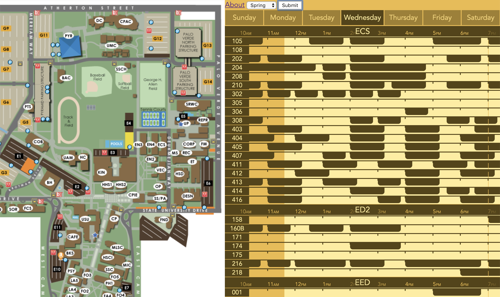

# Antscoper for CSULB

This short project was built from [Antscoper](https://github.com/Krazete/antscoper) to view the class schedule of every single classroom at CSULB.

It was made by the request of [u/ravenwildegir](https://www.reddit.com/r/UCI/comments/ag50qk/i_made_a_thing_with_websoc/ee63kh5/), hence the name of this repository.

## Database
Thanks to the official [CSULB SoC API](http://wdc.csulb.edu/services/web/soc.html) and less arbitrary codes, the process for scraping data is much easier than it is with Antscoper.
[BeautifulSoup4](https://www.crummy.com/software/BeautifulSoup/) is used to gather data from the API and must be installed for this project's Python scripts to run.

## Map
Unlike Antscoper, the map is simply an iframe element linked to CSULB's campus map page.
The map does not interact with the legend at all, only serving as reference for building codes.

## Legend
The legend is nearly an exact copy of the one found on Antscoper.
There is no search box for buildings because, unlike Antscoper, the entire campus's schedule is loaded upon term selection.
Since this loads much more data per request, this app will likely reach the daily quota faster than Antscoper would with the same amount of users.
